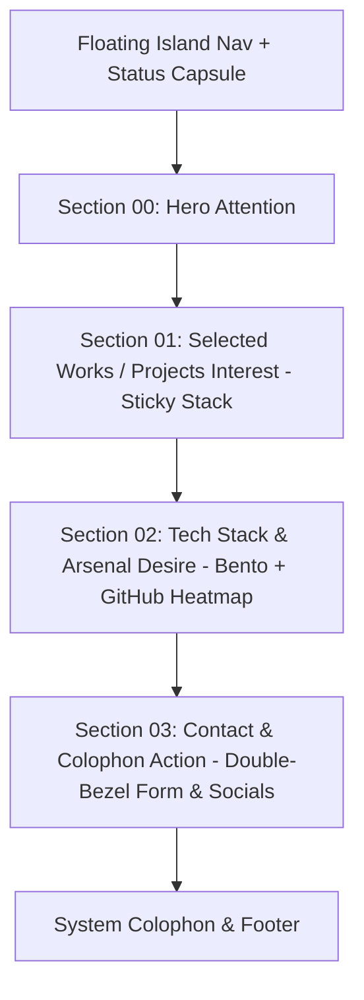

# 🏛️ Portfolio Design System Specification (DESIGN.md)

> **Aesthetic Family:** Cyber-Editorial & High-End Tech (Awwwards-Tier)  
> **Target Audience:** Design-conscious tech recruiters, engineering leaders, founders, and high-ticket clients.  
> **Design Read:** Solo senior engineer & creative developer portfolio, fusing precision cyber-craft (OLED black, subtle ambient glow, retro-pixel accents, glitch typography) with high-end editorial clarity (double-bezel hardware enclosures, generous macro-whitespace, and fluid spring physics).

---

## 1. Executive Summary & Design Read

### 1.1 Core Aesthetic Read
* **Identity:** Cyber-Editorial & High-End Tech.
* **Tone:** Sophisticated, tactile, authoritative, futuristic yet disciplined.
* **Anti-Default Discipline:**
  - **No AI-Slop Defaults:** Banned are generic purple-wash radial blobs, Inter on slate-900, 3-column equal card grids, harsh drop-shadows, and floating badge stamps.
  - **Single Accent Discipline:** Strict single-hue violet-cyan spectrum with sub-80% saturation on deep OLED black (`#040405`).
  - **Zero Emojis in UI:** All UI feedback and labels utilize 1.5px/1.25px precision vector glyphs, never consumer emojis.

### 1.2 The Three Dials Calibration
Based on `design-taste-frontend` specification:

```ts
export const DESIGN_DIALS = {
  DESIGN_VARIANCE: 8,  // 1 = Symmetry, 10 = Artsy Chaos (Asymmetrical bento, dynamic hero, organic particle dispersion)
  MOTION_INTENSITY: 8, // 1 = Static, 10 = Cinematic Physics (GSAP ScrollTrigger, spring physics, magnetic pull, text scramble)
  VISUAL_DENSITY: 4,   // 1 = Gallery/Airy, 10 = Packed Cockpit (Generous py-24 to py-36 spacing with rich telemetry in cards)
} as const;
```

---

## 2. Color System & Theming Tokens

The interface implements a **Dual-State Cyber-OLED & Editorial Light** engine powered by CSS custom properties, transitioning via a canvas-based pixel dissolve.

### 2.1 Dark Palette (Primary Experience)
Deepest OLED black foundation with graphite structural tiers and controlled cyber luminescence:

| Token Name | Hex / Value | Semantic Role |
| :--- | :--- | :--- |
| `--background` | `#040405` | Absolute OLED black canvas |
| `--surface-base` | `#09080d` | Secondary layer & full-width section grounding |
| `--surface-raised` | `#100e16` | Card outer shell (Double-Bezel outer tray) |
| `--surface-overlay` | `#16131d` | Card inner core & active interactive states |
| `--foreground` | `#ededf2` | Primary typography (crisp off-white) |
| `--muted-foreground`| `#9b94a8` | Secondary typography, timestamps, specs |
| `--border` | `rgba(255, 255, 255, 0.08)` | Hairline structural dividers & bezels |
| `--border-subtle` | `rgba(255, 255, 255, 0.04)` | Ambient card rims & grid lines |
| `--accent` | `#8b80df` | Core interactive violet (links, active pills) |
| `--accent-cyan` | `#06b6d4` | Secondary telemetry accent (live status, indicators) |
| `--accent-gradient` | `linear-gradient(115deg, #7064cb 0%, #8276d9 52%, #978ce5 100%)` | Headline text-shimmer & hero glow |
| `--glow-primary` | `rgba(139, 128, 223, 0.12)` | Hero ambient orb & focused card backlights |

### 2.2 Light Palette (Editorial Chalk & Ink)
Clean, high-contrast titanium/chalk surface for daylight readability:

| Token Name | Hex / Value | Semantic Role |
| :--- | :--- | :--- |
| `--background` | `#f7f6f9` | Warm chalk base |
| `--surface-base` | `#efecf4` | Structural backdrop & card trays |
| `--surface-raised` | `#ffffff` | Pure white card cores with crisp hairline borders |
| `--foreground` | `#15131c` | Deep charcoal primary copy |
| `--muted-foreground`| `#6a6479` | Medium muted slate for metadata |
| `--border` | `rgba(20, 18, 30, 0.10)` | Tactile border dividers |
| `--accent` | `#6558c7` | Deep electric purple for high light-mode contrast |

### 2.3 Contrast & Accessibility Guarantees
- **WCAG AA Compliance:** All primary button labels and text on `--background` or `--surface-raised` guarantee a contrast ratio of $\ge 4.5:1$ (body) and $\ge 3:1$ (large display).
- **No Ghost Button Traps:** Buttons never float transparently over photography or particles without a high-contrast backdrop scrim or 1px hairline stroke.

---

## 3. Typographic Hierarchy & Font System

A refined **Cyber-Editorial Hybrid Trio** that marries 8-bit retro gaming nostalgia with ultra-modern sans readability and monospace terminal telemetry.

### 3.1 Font Stack
1. **Display Font:** `'Jersey 15', cursive, sans-serif`
   - *Role:* Hero H1 signature name ("Muuhamed Hany"), section index numbers (`00`, `01`, `02`), and large monogram watermarks.
   - *Discipline:* Rendered with tracking-normal to tight, never exceeding 2 to 3 lines on desktop.
2. **Primary Sans:** `'Manrope', 'Geist Sans', -apple-system, sans-serif`
   - *Role:* Section titles, sub-headlines, card titles, and body paragraphs.
   - *Discipline:* High legibility, neutral geometric proportions, `leading-relaxed`, line length capped at `max-w-[65ch]`.
3. **Monospace Font:** `'JetBrains Mono', ui-monospace, monospace`
   - *Role:* Status badges, code snippets, git contribution telemetry, category filter pills, tech stack tags.
   - *Discipline:* `uppercase tracking-[0.18em]` to `tracking-[0.25em]`, size range `10px` to `12px`.

### 3.2 Typographic Scale

| Level | Font Family | Size (Fluid Clamp) | Tracking / Leading | Description |
| :--- | :--- | :--- | :--- | :--- |
| **Hero Display** | Jersey 15 | `clamp(4.25rem, 15vw, 9.6rem)` | `leading-[0.82] tracking-tight` | Interlocking 2-line name composition |
| **Section H2** | Jersey 15 / Sans | `clamp(2.25rem, 6vw, 4.5rem)` | `leading-[0.95] tracking-tight` | Section entrance headlines |
| **Card H3** | Manrope / Sans | `clamp(1.25rem, 2.5vw, 1.75rem)`| `font-semibold leading-tight` | Project & feature titles |
| **Body Large** | Manrope / Sans | `clamp(1.05rem, 1.5vw, 1.25rem)`| `leading-relaxed text-pretty` | Hero subtext & lead paragraphs ($\le 25$ words) |
| **Body Normal** | Manrope / Sans | `0.95rem – 1.0rem` | `leading-relaxed max-w-[60ch]`| Case study descriptions & about prose |
| **Micro / Tag** | JetBrains Mono | `0.6875rem – 0.75rem` (`11-12px`)| `uppercase tracking-[0.2em]` | Category pills, telemetry, status badges |

---

## 4. Page Architecture & Continuous Flow (AIDA)

Replacing full-viewport wheel interception with a **Natural Continuous Smooth Scroll** powered by GSAP ScrollTrigger and Framer Motion (`motion/react`).



### 4.1 Layout Rhythm & Spacing Rules
- **Macro-Whitespace:** Vertical padding between major sections is strictly standardized at `py-24 sm:py-32 lg:py-40` (`100px` to `160px`).
- **Initial Viewport Guarantee:** The Hero section fits entirely inside `min-h-[100dvh]` without forcing a scrollbar to discover the primary CTAs. Top padding capped at `pt-20 lg:pt-24`.
- **Max Width Container:** Centered wrapper constrained to `max-w-7xl mx-auto px-4 sm:px-8 lg:px-12`.
- **Horizontal Overflow Shield:** Root wrapper enforces `overflow-x-hidden w-full max-w-full` to eliminate horizontal scrollbars caused by off-screen spring reveals.

---

## 5. Component Specifications & Craft Details

### 5.1 The "Double-Bezel" (Doppelrand) Card Architecture
Never place a card flatly on the background. Major containers (project showcases, tech cards, drawer dialogs) must simulate machined physical hardware:

```
┌─────────────────────────────────────────────────────────────┐
│ Outer Shell: bg-white/[0.03], ring-1 ring-white/10, p-2    │
│ rounded-[1.5rem]                                           │
│  ┌───────────────────────────────────────────────────────┐  │
│  │ Inner Core: bg-[#100e16], rounded-[calc(1.5rem-0.5rem)]│  │
│  │ shadow-[inset_0_1px_1px_rgba(255,255,255,0.12)]       │  │
│  │                                                       │  │
│  │ Content: High-res video preview, title, tags, CTA      │  │
│  └───────────────────────────────────────────────────────┘  │
└─────────────────────────────────────────────────────────────┘
```

- **Outer Shell:** Wrapper element with `bg-white/[0.03]` (dark) or `bg-black/[0.03]` (light), hairline ring `border border-border/80`, `p-1.5` or `p-2`, and `rounded-[1.5rem]`.
- **Inner Core:** Content enclosure with `bg-card` (`#100e16`), inner reflection `shadow-[inset_0_1px_1px_rgba(255,255,255,0.1)]`, and calculated concentric curve `rounded-[calc(1.5rem-0.375rem)]`.

### 5.2 Island Buttons with Nested Icon Chambers (Button-in-Button)
Primary interactive buttons follow a nested pill structure:
- **Geometry:** `rounded-full` or pixel-chamfered pill with `px-6 py-3.5`.
- **Trailing Icon Chamber:** The arrow (`↗` or `Download`) NEVER sits naked beside the text. It lives in its own circular chamber (`w-8 h-8 rounded-full bg-white/10 flex items-center justify-center`).
- **Kinetic Hover:** On button hover, the entire button scales slightly (`scale-[1.02]`), while the inner icon chamber translates diagonally (`translate-x-1 -translate-y-0.5 scale-110`).
- **Single Line Rule:** Button text MUST fit on a single line at all viewports (2-3 words max: *"Explore Work"*, *"Get In Touch"*).

### 5.3 Floating Island Navigation (Nav & Section Spy)
- **Geometry:** Detached floating glass pill (`mt-5 mx-auto w-max rounded-full px-4 py-2 border border-white/10 bg-black/60 backdrop-blur-2xl`).
- **Indicator:** Layout-animated active pill indicator (`layoutId="activeNavPill"`) gliding behind the active section label as the user scrolls.
- **Micro-Controls:** Integrated theme toggle (triggering the pixel dissolve) and status ping ("Available for hire").

### 5.4 Sticky-Stack Project Showcase
- **Mechanism:** As the user scrolls vertically through Section 01, each project card pins at `top: 12vh` using GSAP ScrollTrigger.
- **Card Scrub:** When the subsequent card arrives, the previous card scales down smoothly to `scale: 0.92`, dims to `opacity: 0.45`, and blurs slightly (`blur-[2px]`), building a physical stack.
- **Media Presentation:** Each card features an auto-playing muted loop preview (Cloudflare R2 hosted WebP/MP4) with custom double-bezel framing and tag chips.

### 5.5 Tech Arsenal Bento & GitHub Telemetry
- **Gapless Execution:** Employs CSS Grid with `grid-auto-flow: dense` to mathematically guarantee zero empty grid holes.
- **Heatmap Card:** Live interactive GitHub contribution chart showing recent commit density.
- **Tech Capsules:** Curated stack categorized by discipline (Languages, Frontend, Backend & Cloud, Creative Tech), each carrying an official SVG logo (Simple Icons) and proficiency metadata.

---

## 6. Motion Choreography & Fluid Dynamics

Static interfaces are prohibited. All animations simulate real mass, spring physics, and kinetic responsiveness.

### 6.1 Spring & Cubic-Bezier Constants

```ts
export const MOTION_PRESETS = {
  // Ultra-fluid agency transition for hover and layout shifts
  fluidEase: [0.16, 1, 0.3, 1] as const, // Custom cubic-bezier
  
  // Spring configuration for physical interactions (magnetic pull, modal pop)
  tactileSpring: {
    type: "spring",
    stiffness: 140,
    damping: 18,
    mass: 0.8,
  },

  // Heavy entrance transitions
  revealSpring: {
    duration: 0.85,
    ease: [0.16, 1, 0.3, 1],
  },
} as const;
```

### 6.2 Kinetic Micro-Interactions
1. **Glitch Text Scramble:** Display names and numerals trigger a high-speed ASCII/matrix character scramble on hover or section entry, settling into the final text over 400ms.
2. **Hero Interactive Particle Canvas:** Canvas-based fluid particle bridge responding to cursor velocity with spring-based repatriation.
3. **Magnetic Cursor Damping:** Primary CTAs and icon pills lightly pull toward the cursor coordinate when mouse distance $< 60px$.
4. **Theme Pixel Dissolve:** Toggling between dark and light initiates a screen-filling pixelated wave transition originating from the click origin coordinate.

### 6.3 Animation Guardrails
- **GPU-Safe Rule:** Animate exclusively via `transform` (`x`, `y`, `scale`, `rotate`) and `opacity`. Strictly ban animating `top`, `left`, `width`, or `height`.
- **Reduced Motion Support (`prefers-reduced-motion`):** When enabled, instantly bypass all GSAP pinning, scroll scrubs, and glitch intervals, falling back to clean static CSS opacity reveals.

---

## 7. Media, Iconography & Asset Standards

### 7.1 Iconography Rules
- **Single Family Standard:** Phosphor Icons (`@phosphor-icons/react`) or ultra-refined Lucide (`lucide-react`).
- **Consistent Stroke:** Standardized at `1.5px` or `1.25px` across the entire application. No mixing thick 2.5px icons with thin 1px icons.
- **Tech Brand Logos:** Official SVGs sourced strictly from `Simple Icons` (`https://cdn.simpleicons.org/{slug}`) to ensure genuine vector fidelity in both color themes.

### 7.2 Media & Cloudflare R2 Optimization
- **Format Order:**
  1. Animated Previews: Loop MP4 (`video/mp4; codecs=hvc1,avc1`) or WebP with poster image fallback.
  2. Static Photography: Optimized WebP or AVIF with explicit width and height dimensions to prevent cumulative layout shift (CLS).
- **Hosting:** Media assets streamed from Cloudflare R2 (`https://media.muuhamedhany.dev/...`) with edge caching and range request support.

---

## 8. Mobile Ergonomics & Breakpoint Collapses

Desktop asymmetry must translate into an intuitive, responsive mobile experience.

### 8.1 Breakpoint Standards
- Mobile: `< 640px` (`sm`)
- Tablet: `640px – 1023px` (`md`)
- Desktop: `1024px – 1279px` (`lg`)
- Wide Canvas: `1280px+` (`xl`, `2xl`)

### 8.2 Touch Ergonomics & Adaptations
- **Touch Targets:** All interactive links, buttons, and drawer triggers maintain a minimum touch bounding box of `44px x 44px`.
- **Asymmetric Grid Collapse:**
  - Bento grids collapse from multi-column layouts to single-column vertical stacks (`grid-cols-1 gap-6`).
  - Desktop sticky-stack card scaling simplifies to a vertical stack with standard top margins on mobile viewports to prevent iOS Safari gesture hijacking.
- **Blur Throttling:** On touch devices (`@media (pointer: coarse)`), heavy backdrop blurs on moving elements are replaced with solid tinted fills (`bg-black/90`) to maintain 60fps scrolling.

---

## 9. Agency Pre-Flight Quality Checklist

Before shipping any frontend section or component update, the code must satisfy this strict verification matrix:

- [ ] **No Banned Fonts:** No Inter, Roboto, Arial, or generic system defaults used for display.
- [ ] **Hero 2-Line Rule:** The main H1 does not exceed 2 lines on desktop; hero subtext is $\le 20$ words.
- [ ] **Initial Viewport Integrity:** Hero fits within `min-h-[100dvh]` without forcing scrollbar to reach CTAs.
- [ ] **Single Accent Rule:** One focused accent spectrum (violet/cyan) used consistently across all sections.
- [ ] **Button Wrap Ban:** Every CTA fits on exactly 1 line at desktop; no multi-line wrapping.
- [ ] **Double-Bezel Construction:** All major cards implement the outer shell + inner core nested architecture.
- [ ] **Button-in-Button:** Primary CTAs nest trailing icons inside discrete circular capsules.
- [ ] **Gapless Bento:** CSS grid utilizes `grid-auto-flow: dense` with zero vacant cells.
- [ ] **Eyebrow Discipline:** Maximum 1 eyebrow tag per 3 sections (no repetitive uppercase stamps).
- [ ] **WCAG AA Check:** Text contrast is $\ge 4.5:1$ on all interactive elements and content surfaces.
- [ ] **GPU-Safe Motion:** Animations strictly mutate `transform` and `opacity`; no layout thrashing.
- [ ] **Reduced Motion:** Verified clean fallback with `useReducedMotion()`.
- [ ] **Mobile Collapse:** Verified that all asymmetric grids collapse cleanly below 768px.
